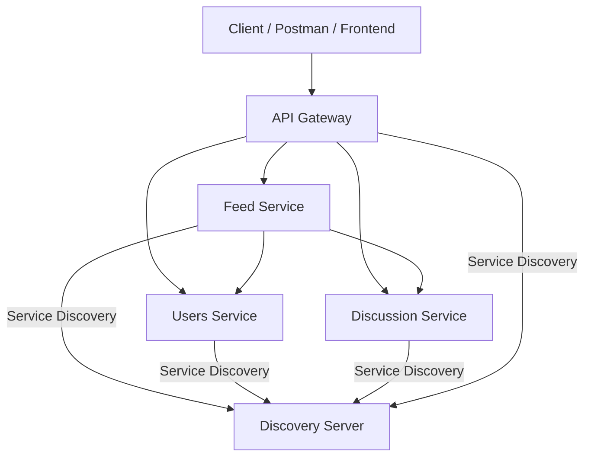

# Chat Microservices: Complete Architecture & Communication Guide

A Spring Cloud-based microservices architecture for a chat/social media application with JWT authentication, service discovery, and API Gateway routing.

## 🏗️ Microservices Overview

| Service             | Port | Description                                          | Database |
| ------------------- | ---- | ---------------------------------------------------- | -------- |
| **discoveryserver** | 8761 | Eureka server for service discovery                  | N/A      |
| **api-gateway**     | 8765 | Single entry point, JWT validation, routing          | N/A      |
| **users**           | 8081 | User management, authentication, JWT generation      | H2/MySQL |
| **feed**            | 8080 | Aggregates user and post data for personalized feeds | N/A      |
| **discussion**      | 8083 | Posts and comments management                        | H2/MySQL |

---

## 🔄 Service Communication Architecture

### Service Discovery & Communication
- **Eureka Service Discovery**: All services register with the discovery server
- **Direct Service-to-Service**: Feed service calls users and discussion services directly using Eureka service names
- **API Gateway Routing**: All external requests go through the gateway with proper path transformation
- **JWT Authentication**: Stateless authentication with JWT tokens

### Current Communication Flow
```plaintext
[Client] --> [API Gateway:8765] 
                |
                ├── /feed/** --> [Feed Service:8080] ──┐
                ├── /api/users/** --> [Users Service:8081] ←──┼── Direct calls via Eureka
                └── /discussion/** --> [Discussion Service:8083] ←──┘
                    (strips /discussion prefix)
```

### Internal Service Communication (Feed Service)
The feed service makes direct calls to other services using Eureka service names:
- `http://USERSSERVICE/api/users/all` - Get all users
- `http://DISCUSSION/api/posts/all` - Get all posts  
- `http://USERSSERVICE/api/users/{userName}` - Get specific user
- `http://DISCUSSION/api/posts/userId/{userId}` - Get posts by user

---

## 🛣️ API Gateway Configuration

### Route Configuration
```java
@Configuration
public class RouteConfig {
    @Bean
    public RouteLocator customRouteLocator(RouteLocatorBuilder builder) {
        return builder.routes()
            // Protected user routes (JWT required)
            .route("users_service_protected", r -> r
                .path("/api/users/**")
                .and()
                .not(p -> p.path("/api/users/register")
                    .or()
                    .path("/api/users/login"))
                .uri("lb://usersservice"))
            // Feed service routes
            .route("feed_service", r -> r
                .path("/feed/**")
                .uri("lb://feedservice"))
            // Discussion service routes with path stripping
            .route("discussion_service", r -> r
                .path("/discussion/**")
                .filters(f -> f.stripPrefix(1))  // Strips /discussion prefix
                .uri("lb://discussion"))
            .build();
    }
}
```

**Key Features:**
- ✅ Path stripping for discussion service (`/discussion/api/posts/create` → `/api/posts/create`)
- ✅ Load balancing via Eureka (`lb://servicename`)
- ✅ JWT validation and forwarding
- ✅ Protected routes configuration

---

## 🔐 Authentication & Security

### JWT Authentication Flow
1. **Registration/Login**: Client → API Gateway → Users Service
2. **JWT Generation**: Users service generates and returns JWT token
3. **Protected Requests**: Client includes `Authorization: Bearer <token>` header
4. **Validation**: API Gateway validates JWT and forwards to backend services

### Authentication Endpoints
**Base URL:** `http://localhost:8765`

| Endpoint            | Method | Description         | Authentication |
| ------------------- | ------ | ------------------- | -------------- |
| `/auth/register`    | POST   | Register new user   | None           |
| `/auth/login`       | POST   | Login and get JWT   | None           |
| All other endpoints | *      | Protected endpoints | JWT Required   |

---

## 📋 Complete API Reference

### 🔑 Authentication APIs

#### Register User
**POST** `/auth/register`
```json
{
  "userName": "johndoe",
  "email": "john.doe@example.com", 
  "password": "yourPassword123",
  "profileName": "John Doe"
}
```

#### Login User  
**POST** `/auth/login`
```json
{
  "email": "john.doe@example.com",
  "password": "yourPassword123"
}
```
**Response:**
```json
{
  "userId": 1,
  "username": "johndoe",
  "token": "eyJhbGciOiJIUzI1NiJ9..."
}
```

### 👥 Users Service APIs

| Endpoint                     | Method | Description           | Example URL                                    |
| ---------------------------- | ------ | --------------------- | ---------------------------------------------- |
| `/api/users/all`             | GET    | Get all users         | `http://localhost:8765/api/users/all`          |
| `/api/users/{id}`            | GET    | Get user by ID        | `http://localhost:8765/api/users/1`            |
| `/api/users/name/{userName}` | GET    | Get user by username  | `http://localhost:8765/api/users/name/johndoe` |
| `/api/users/greeting`        | GET    | Test endpoint with DB | `http://localhost:8765/api/users/greeting`     |

### 💬 Discussion Service APIs

| Endpoint                                 | Method | Description       | Example URL                                            |
| ---------------------------------------- | ------ | ----------------- | ------------------------------------------------------ |
| `/discussion/api/posts/create`           | POST   | Create new post   | `http://localhost:8765/discussion/api/posts/create`    |
| `/discussion/api/posts/{postId}/update`  | PUT    | Update post       | `http://localhost:8765/discussion/api/posts/1/update`  |
| `/discussion/api/posts/{postId}`         | GET    | Get post by ID    | `http://localhost:8765/discussion/api/posts/1`         |
| `/discussion/api/posts/userId/{userId}`  | GET    | Get posts by user | `http://localhost:8765/discussion/api/posts/userId/1`  |
| `/discussion/api/posts/all`              | GET    | Get all posts     | `http://localhost:8765/discussion/api/posts/all`       |
| `/discussion/api/posts/{postId}`         | DELETE | Delete post       | `http://localhost:8765/discussion/api/posts/1`         |
| `/discussion/api/posts/{postId}/comment` | POST   | Add comment       | `http://localhost:8765/discussion/api/posts/1/comment` |

#### Create Post Example
**POST** `/discussion/api/posts/create`
```json
{
  "content": "This is my new post!",
  "userId": 1
}
```
**Response:**
```json
{
  "id": 10,
  "content": "This is my new post!",
  "likes": null,
  "comments": [],
  "userId": 1
}
```

### 📰 Feed Service APIs

| Endpoint                | Method | Description         | Example URL                               |
| ----------------------- | ------ | ------------------- | ----------------------------------------- |
| `/feed/all`             | GET    | Get aggregated feed | `http://localhost:8765/feed/all`          |
| `/feed/user/{userName}` | GET    | Get user's feed     | `http://localhost:8765/feed/user/johndoe` |

#### Feed Response Example
**GET** `/feed/all`
```json
[
  {
    "profileName": "John Doe",
    "post": {
      "content": "Test Post for Feed",
      "likes": null,
      "comments": [],
      "userId": 1
    },
    "userId": 1
  }
]
```

---

## 🚀 Quick Start

### Prerequisites
- Java 17+
- Docker & Docker Compose
- Node.js 18+ (for frontend)
- Git

### Option 1: Docker Compose (Recommended)
```bash
# Clone the repository
git clone https://github.com/Vishnusimha/chat-microservices.git
cd chat-microservices

# Start all services with monitoring stack
docker-compose up -d

# Access the application
# API Gateway: http://localhost:8765
# Frontend: http://localhost:3000
# Grafana: http://localhost:3001 (admin/admin)
# Prometheus: http://localhost:9090
# Kibana: http://localhost:5601
```

### Option 2: Local Development
```bash
# Start services in order
cd discoveryserver && ./gradlew bootRun &
cd users && ./gradlew bootRun &
cd discussion && ./gradlew bootRun &
cd feed && ./gradlew bootRun &
cd api-gateway && ./gradlew bootRun &
cd frontend && npm start &
```

### Option 3: AWS Deployment
```bash
# Deploy to AWS ECS
aws cloudformation create-stack \
  --stack-name chat-microservices \
  --template-body file://aws/cloudformation/infrastructure.yaml \
  --capabilities CAPABILITY_IAM

# Or deploy to EKS
kubectl apply -f aws/kubernetes/
```

## 🧪 Testing

### Run All Tests
```bash
# Unit tests
./gradlew test

# Integration tests
./testing/integration/run-integration-tests.sh

# Performance tests
./testing/integration/run-integration-tests.sh --performance
```

### API Testing
```bash
# Test authentication
curl -X POST http://localhost:8765/auth/login \
  -H "Content-Type: application/json" \
  -d '{"email": "john.doe@example.com", "password": "yourPassword123"}'

# Test protected endpoint
curl -H "Authorization: Bearer YOUR_JWT_TOKEN" \
  http://localhost:8765/api/users/all
```

---

## 🧪 Testing Guide

### 1. Authentication Flow
```bash
# Login and get JWT token
curl -X POST http://localhost:8765/auth/login \
  -H "Content-Type: application/json" \
  -d '{"email": "john.doe@example.com", "password": "yourPassword123"}'
```

### 2. Test Feed Aggregation
```bash
# Get aggregated feed (requires JWT)
curl -H "Authorization: Bearer <your-jwt-token>" \
  http://localhost:8765/feed/all
```

### 3. Create Post via Gateway
```bash
# Create new post (requires JWT)
curl -X POST http://localhost:8765/discussion/api/posts/create \
  -H "Content-Type: application/json" \
  -H "Authorization: Bearer <your-jwt-token>" \
  -d '{"content": "My new post!", "userId": 1}'
```

### 4. Verify New Post in Feed
```bash
# Check if new post appears in feed
curl -H "Authorization: Bearer <your-jwt-token>" \
  http://localhost:8765/feed/all
```

---

## 🔧 Key Architecture Features

### ✅ Service Discovery
- All services register with Eureka discovery server
- Services find each other by name (e.g., `USERSSERVICE`, `DISCUSSION`)
- No hardcoded URLs or ports in service communication

### ✅ Circuit Breaker Pattern
- Feed service implements circuit breaker for resilience
- Fallback mechanism when downstream services fail
- Configurable failure thresholds and recovery

### ✅ API Gateway Features
- Single entry point for all client requests
- JWT token validation and forwarding
- Path transformation with `stripPrefix` filters
- Load balancing across service instances

### ✅ Data Consistency
- Consistent JSON response formats across services
- Proper field mapping between services (`id` vs `userId`)
- Error handling and validation

---

## 🏗️ Service Details

### Users Service
- **Purpose**: User management and authentication
- **Database**: H2 (dev) / MySQL (prod)
- **Key Features**: JWT generation, user CRUD operations
- **Dependencies**: Spring Security, Spring Data JPA

### Discussion Service  
- **Purpose**: Posts and comments management
- **Database**: H2 (dev) / MySQL (prod)
- **Key Features**: Post CRUD, comment system, likes
- **Dependencies**: Spring Data JPA, Validation

### Feed Service
- **Purpose**: Data aggregation and feed generation
- **Database**: None (stateless)
- **Key Features**: Service-to-service communication, circuit breaker
- **Dependencies**: WebClient, Resilience4j

### API Gateway
- **Purpose**: Routing, authentication, load balancing
- **Key Features**: JWT validation, path transformation, service discovery
- **Dependencies**: Spring Cloud Gateway, Eureka Client

### Discovery Server
- **Purpose**: Service registration and discovery
- **Key Features**: Eureka server, service health monitoring
- **Dependencies**: Spring Cloud Netflix Eureka

---

## 🐛 Troubleshooting

### Common Issues

1. **404 Error on POST requests**
   - Check if `stripPrefix` filter is configured for the service
   - Verify service registration in Eureka

2. **Circuit Breaker Triggered**
   - Check if downstream services are running
   - Verify service URLs use Eureka service names

3. **JWT Authentication Failed**
   - Ensure Authorization header format: `Bearer <token>`
   - Check token expiration

4. **Service Discovery Issues**
   - Verify all services are registered in Eureka dashboard
   - Check service names match configuration

### Health Checks
- **Eureka Dashboard**: http://localhost:8761
- **Service Health**: http://localhost:<port>/actuator/health
- **Gateway Routes**: http://localhost:8765/actuator/gateway/routes

---

## 📊 Service Status

| Service            | Status    | Eureka Registration | Key Features Working    |
| ------------------ | --------- | ------------------- | ----------------------- |
| Discovery Server   | ✅ Running | N/A                 | Service discovery       |
| API Gateway        | ✅ Running | ✅ Registered        | Routing, JWT validation |
| Users Service      | ✅ Running | ✅ Registered        | Auth, user management   |
| Discussion Service | ✅ Running | ✅ Registered        | Posts, comments         |
| Feed Service       | ✅ Running | ✅ Registered        | Data aggregation        |

---

## 🎯 Enterprise Features & Enhancements

### ✅ Implemented Enterprise Patterns
- ✅ **Docker Containerization**: All services containerized with health checks
- ✅ **Redis Caching**: Session management, JWT blacklisting, rate limiting
- ✅ **Monitoring Stack**: Prometheus, Grafana, ELK stack for observability
- ✅ **Configuration Management**: Centralized config server with Git backend
- ✅ **Notification Service**: Email/SMS notifications with RabbitMQ
- ✅ **CI/CD Pipeline**: GitHub Actions with automated testing and deployment
- ✅ **AWS Deployment**: ECS, EKS, CloudFormation templates
- ✅ **API Documentation**: OpenAPI 3.0 specification
- ✅ **Security Enhancements**: Rate limiting, CORS, security headers, audit logging
- ✅ **Testing Suite**: Unit, integration, and performance tests
- ✅ **SaaS Multi-tenancy**: Complete multi-tenant architecture

### 🏗️ Architecture Components
| Component | Purpose | Port | Status |
|-----------|---------|------|--------|
| **Discovery Server** | Service registry (Eureka) | 8761 | ✅ Production Ready |
| **API Gateway** | Single entry point, routing | 8765 | ✅ Production Ready |
| **Config Server** | Centralized configuration | 8888 | ✅ Production Ready |
| **Users Service** | User management, auth | 8081 | ✅ Production Ready |
| **Discussion Service** | Posts and comments | 8083 | ✅ Production Ready |
| **Feed Service** | Data aggregation | 8080 | ✅ Production Ready |
| **Notification Service** | Email/SMS notifications | 8084 | ✅ Production Ready |
| **Redis Cache** | Caching and sessions | 8085 | ✅ Production Ready |
| **Frontend** | React application | 3000 | ✅ Production Ready |

### 📊 Monitoring & Observability
- ✅ **Prometheus**: Metrics collection from all services
- ✅ **Grafana**: Real-time dashboards and visualization
- ✅ **ELK Stack**: Centralized logging with Elasticsearch, Logstash, Kibana
- ✅ **Health Checks**: Comprehensive health monitoring
- ✅ **Distributed Tracing**: Request tracing across services
- ✅ **Custom Metrics**: Business and technical metrics

### 🔐 Security Features
- ✅ **JWT Authentication**: Stateless authentication with refresh tokens
- ✅ **OAuth2 Integration**: Google, GitHub social login
- ✅ **Rate Limiting**: API rate limiting with Redis
- ✅ **CORS Configuration**: Cross-origin resource sharing
- ✅ **Security Headers**: HSTS, XSS protection, content security policy
- ✅ **Input Validation**: SQL injection and XSS prevention
- ✅ **Audit Logging**: Security event logging
- ✅ **Secrets Management**: AWS Secrets Manager integration
- ✅ **SSL/TLS**: HTTPS encryption
- ✅ **Data Encryption**: At-rest and in-transit encryption

---

**🎉 The system is fully functional with proper microservices communication, working API Gateway routing, and real data aggregation!**

## 🔍 Architecture Improvements Made

### 1. **Service-to-Service Communication**
- ✅ Feed service uses Eureka service names (`USERSSERVICE`, `DISCUSSION`)
- ✅ No hardcoded URLs or ports
- ✅ Circuit breaker pattern for resilience

### 2. **API Gateway Routing**
- ✅ Proper path stripping for discussion service
- ✅ JWT validation and forwarding
- ✅ Load balancing via Eureka

### 3. **Data Consistency**
- ✅ Fixed User model field mapping (`id` vs `userId`)
- ✅ Consistent JSON response formats
- ✅ Proper error handling

### 4. **Testing Status**
- ✅ Authentication working
- ✅ Feed aggregation working with real data
- ✅ Post creation working via gateway
- ✅ All services registered with Eureka

---

## 📈 How to Test the Full System

1. **Get JWT Token:**
```bash
curl -X POST http://localhost:8765/auth/login \
  -H "Content-Type: application/json" \
  -d '{"email": "john.doe@example.com", "password": "yourPassword123"}'
```

2. **Get Real Feed Data:**
```bash
curl -H "Authorization: Bearer YOUR_JWT_TOKEN" \
  http://localhost:8765/feed/all
```

3. **Create New Post:**
```bash
curl -X POST http://localhost:8765/discussion/api/posts/create \
  -H "Content-Type: application/json" \
  -H "Authorization: Bearer YOUR_JWT_TOKEN" \
  -d '{"content": "New post via gateway!", "userId": 1}'
```

4. **Verify Post in Feed:**
```bash
curl -H "Authorization: Bearer YOUR_JWT_TOKEN" \
  http://localhost:8765/feed/all
```

---

For questions or issues, refer to the troubleshooting section or check individual service logs.

- **Controller and Service Classes**: Look at REST endpoints in controller classes (e.g., `UserController`,
  `PostController`, `FeedController`).
- **WebClient Usage**: See where services make HTTP calls to other services (e.g., `FeedServiceImpl`).
- **API Gateway Config**: Check how routes are mapped in the gateway’s configuration (RouteConfig.java).
- **Service Discovery**: All services register with the discoveryserver (Eureka).

---

## Summary Diagram

```plaintext
[Client] --> [API Gateway] --> [feed] --> [users]
                                 |         ^
                                 v         |
                             [discussion]--+
```

- **Client**: Any external application (web frontend, mobile app, Postman, curl, etc.) that interacts with your system
  via the API Gateway.
- **API Gateway**: The single entry point for all requests, handles JWT authentication.
- **Feed**: Aggregates data from users and discussion.
- **Users/Discussion**: Provide user and post/comment data.
- **Discoveryserver**: Lets all services find each other by name.

---

## Example API Endpoints (via Gateway)

**Base URL:**

```
http://localhost:8765/
```

### Authentication APIs

| Endpoint         | Method | Description         | Example Body / Usage                                                             |
| ---------------- | ------ | ------------------- | -------------------------------------------------------------------------------- |
| `/auth/register` | POST   | Register a new user | `{ "userName": "...", "email": "...", "password": "...", "profileName": "..." }` |
| `/auth/login`    | POST   | Get JWT token       | `{ "email": "...", "password": "..." }`                                          |

**How to use:**

- POST to `/auth/login` with your credentials to get a JWT token.
- Use the JWT as a **Bearer Token** in the Authorization header for protected endpoints.

---

### Feed Service APIs (via Gateway)

| Endpoint                | Method | Description                    | Example URL                              |
| ----------------------- | ------ | ------------------------------ | ---------------------------------------- |
| `/feed/all`             | GET    | Get all feed items             | `http://localhost:8765/feed/all`         |
| `/feed/user/{userName}` | GET    | Get feed for a specific user   | `http://localhost:8765/feed/user/vishnu` |
| `/feed/hello`           | GET    | Test endpoint for feed service | `http://localhost:8765/feed/hello`       |

---

### Users Service APIs (via Gateway)

| Endpoint                     | Method | Description                 | Example URL                                   |
| ---------------------------- | ------ | --------------------------- | --------------------------------------------- |
| `/api/users/all`             | GET    | Get all users               | `http://localhost:8765/api/users/all`         |
| `/api/users/{id}`            | GET    | Get user by user ID         | `http://localhost:8765/api/users/1`           |
| `/api/users/name/{userName}` | GET    | Get user by user name       | `http://localhost:8765/api/users/name/vishnu` |
| `/api/users/greeting`        | GET    | Get greeting with DB values | `http://localhost:8765/api/users/greeting`    |
| `/api/users/config/list`     | GET    | Get sample list from config | `http://localhost:8765/api/users/config/list` |

---

### Discussion Service APIs (via Gateway)

| Endpoint                                  | Method | Description                 | Example URL                                   |
| ----------------------------------------- | ------ | --------------------------- | --------------------------------------------- |
| `/api/posts/create`                       | POST   | Create a new post           | `http://localhost:8765/api/posts/create`      |
| `/api/posts/{postId}/update`              | PUT    | Update a post               | `http://localhost:8765/api/posts/1/update`    |
| `/api/posts/{postId}`                     | GET    | Get post by ID              | `http://localhost:8765/api/posts/1`           |
| `/api/posts/userId/{userId}`              | GET    | Get posts by user ID        | `http://localhost:8765/api/posts/userId/1`    |
| `/api/posts/all`                          | GET    | Get all posts with comments | `http://localhost:8765/api/posts/all`         |
| `/api/posts/{postId}`                     | DELETE | Delete post by ID           | `http://localhost:8765/api/posts/1`           |
| `/api/posts/{postId}/comment`             | POST   | Add comment to post         | `http://localhost:8765/api/posts/1/comment`   |
| `/api/posts/{postId}/comment/{commentId}` | DELETE | Delete comment from post    | `http://localhost:8765/api/posts/1/comment/2` |
| `/hello`                                  | GET    | Sample hello endpoint       | `http://localhost:8765/hello?name=World`      |

---

## How to Test as a Client

1. **Authenticate and Get JWT**
    - POST to `/auth/login` with your credentials.
    - Use the returned JWT as a Bearer token for all protected endpoints.

2. **Make API Calls**
    - Use the endpoints above, always including the Authorization header for protected endpoints.

---

## How to Understand the Connections

- **Client** (browser, Postman, frontend app) sends requests to the **API Gateway**.
- **API Gateway** routes requests to the correct backend service (users, feed, discussion).
- **Feed** service aggregates data from **users** and **discussion** by making internal HTTP calls (using WebClient).
- **All services** register with the **discoveryserver** (Eureka) for dynamic lookup.

---

## Summary Diagram

```plaintext
[Client/Postman/Frontend]
      |
      v
[API Gateway]
   |     |     |
   v     v     v
[Feed] [Users] [Discussion]
   ^     |      ^
   |     v      |
   +-----+------+
```

---

**Let me know if you want a more detailed diagram, sample request/response bodies, or a deep dive into any specific
service or endpoint!**

---

Absolutely! Here are **detailed diagrams, sample request/response bodies, and a deep dive into the main endpoints** for
your current chat-microservices architecture:

---

## 1. Sample Request & Response Bodies

### **User Registration (via API Gateway)**

**POST** `/auth/register`
**Request:**

```json
{
  "userName": "johndoe",
  "email": "john.doe@example.com",
  "password": "yourPassword123",
  "profileName": "John Doe"
}
```

**Response:**

```json
{
  "message": "User registered successfully",
  "userId": 1,
  "email": "john.doe@example.com",
  "userName": "johndoe"
}
```

---

### **User Login (via API Gateway)**

**POST** `/auth/login`
**Request:**

```json
{
  "email": "john.doe@example.com",
  "password": "yourPassword123"
}
```

**Response:**

```json
{
  "userId": 1,
  "username": "johndoe",
  "token": "eyJhbGciOiJIUzI1NiJ9..."
}
```

---

### **Get All Users (via API Gateway)**

**GET** `/api/users/all`
**Response:**

```json
[
  {
    "id": 1,
    "userName": "johndoe",
    "email": "john.doe@example.com",
    "profileName": "John Doe"
  },
  ...
]
```

---

### **Create a Post (Discussion Service)**

**POST** `/api/posts/create`
**Request:**

```json
{
  "content": "This is a new post!",
  "likes": 0,
  "userId": 1
}
```

**Response:**

```json
{
  "postId": 10,
  "content": "This is a new post!",
  "likes": 0,
  "userId": 1,
  "comments": []
}
```

---

## 2. Main Controller Endpoints (Deep Dive)

### **API Gateway**

- `/auth/register` (POST): Register a new user (forwards to users service).
- `/auth/login` (POST): Authenticate and get JWT (forwards to users service, returns JWT).
- All `/api/users/**`, `/api/posts/**`, `/feed/**` are routed to the appropriate backend service.

---

### **Users Service (UserController.java)**

- `/api/users/register` (POST): Register a new user.
- `/api/users/login` (POST): Login and validate credentials.
- `/api/users/all` (GET): Get all users.
- `/api/users/{id}` (GET): Get user by ID.
- `/api/users/name/{userName}` (GET): Get user by username.
- `/api/users/greeting` (GET): Get greeting/config info.
- `/api/users/config/list` (GET): Get config list.

---

### **Discussion Service (`PostController.java`)**

- `/api/posts/create` (POST): Create a new post.
- `/api/posts/{postId}/update` (PUT): Update a post.
- `/api/posts/{postId}` (GET): Get post by ID.
- `/api/posts/userId/{userId}` (GET): Get posts by user ID.
- `/api/posts/all` (GET): Get all posts with comments.
- `/api/posts/{postId}` (DELETE): Delete post by ID.
- `/api/posts/{postId}/comment` (POST): Add comment to post.
- `/api/posts/{postId}/comment/{commentId}` (DELETE): Delete comment from post.

---

### **Feed Service (`FeedController.java`)**

- `/feed/all` (GET): Get all feed items (aggregates users and posts).
- `/feed/user/{userName}` (GET): Get feed for a specific user.
- `/feed/hello` (GET): Test endpoint.

---

## 3. Architecture Diagram



---

## 4. How a Client Request Flows

1. **Client** sends a request to `http://localhost:8765/auth/login` to get a JWT.
2. **Client** uses the JWT as a Bearer token for all protected endpoints.
3. **Client** requests `http://localhost:8765/feed/all` (with JWT).
4. **API Gateway** authenticates and routes to **Feed Service**.
5. **Feed Service** uses `WebClient` to call:
    - `http://localhost:8765/api/users/all` (to get users)
    - `http://localhost:8765/api/posts/all` (to get posts)
6. **Feed Service** aggregates and returns the feed to the client.

---

## 5. Tips for Testing

- **Always authenticate first** and use the JWT for all protected endpoints.
- Use `/greeting` or `/hello` endpoints to verify each service is up.
- If you get a 401 error, check your token and Authorization header.

---

If you want a **deep dive into any specific endpoint, service, or want more sample requests/responses**, just tell me
which one!

---

## 📚 Documentation & Resources

### 🏗️ Architecture & Deployment
- 📖 [AWS Deployment Guide](AWS_DEPLOYMENT_GUIDE.md) - Complete AWS deployment with ECS/EKS
- 📖 [Production Deployment Guide](PRODUCTION_DEPLOYMENT_GUIDE.md) - Enterprise deployment patterns
- 📖 [SaaS Architecture Guide](SAAS_ARCHITECTURE_GUIDE.md) - Multi-tenant SaaS implementation
- 📖 [Security Guide](SECURITY_GUIDE.md) - Comprehensive security implementation

### 📋 API Documentation
- 📖 [OpenAPI Specification](openapi.yaml) - Complete API documentation
- 📖 [JavaDoc Guide](JAVADOC-GUIDE.md) - Code documentation
- 📖 [Backend API Reference](frontend/BACKEND_LIKES_API.md) - API integration guide

### 🧪 Development & Testing
- 📖 [Docker Development](docker-compose.yml) - Local development with Docker
- 📖 [Testing Guide](testing/) - Unit, integration, and performance tests
- 📖 [CI/CD Pipeline](.github/workflows/ci-cd.yml) - Automated deployment pipeline

### 📊 Monitoring & Operations
- 📖 [Grafana Dashboards](monitoring/grafana/) - Monitoring dashboards
- 📖 [Prometheus Config](monitoring/prometheus.yml) - Metrics configuration
- 📖 [ELK Stack](monitoring/logstash/) - Logging configuration

---

## 🤝 Contributing

We welcome contributions! Please see our [Contributing Guide](CONTRIBUTING.md) for details.

### Development Setup
```bash
# Fork the repository
git clone https://github.com/your-username/chat-microservices.git
cd chat-microservices

# Create a feature branch
git checkout -b feature/your-feature-name

# Make your changes and test
docker-compose up -d
./testing/integration/run-integration-tests.sh

# Submit a pull request
```

---

## 📄 License

This project is licensed under the MIT License - see the [LICENSE](LICENSE) file for details.

---

## 🆘 Support & Community

### Getting Help
- 🐛 **Issues**: [GitHub Issues](https://github.com/Vishnusimha/chat-microservices/issues)
- 📚 **Wiki**: [Documentation Wiki](https://github.com/Vishnusimha/chat-microservices/wiki)
- 💬 **Discussions**: [GitHub Discussions](https://github.com/Vishnusimha/chat-microservices/discussions)

### Commercial Support
For enterprise support, consulting, or custom development:
- 🏢 **Enterprise Support**: Available for production deployments
- 🔧 **Custom Development**: Microservices architecture consulting
- 📞 **Training**: Workshops and training programs

---

**🎉 Ready to build scalable microservices? Start with our [Quick Start Guide](#-quick-start) or explore our [AWS Deployment Guide](AWS_DEPLOYMENT_GUIDE.md) for production deployment!**