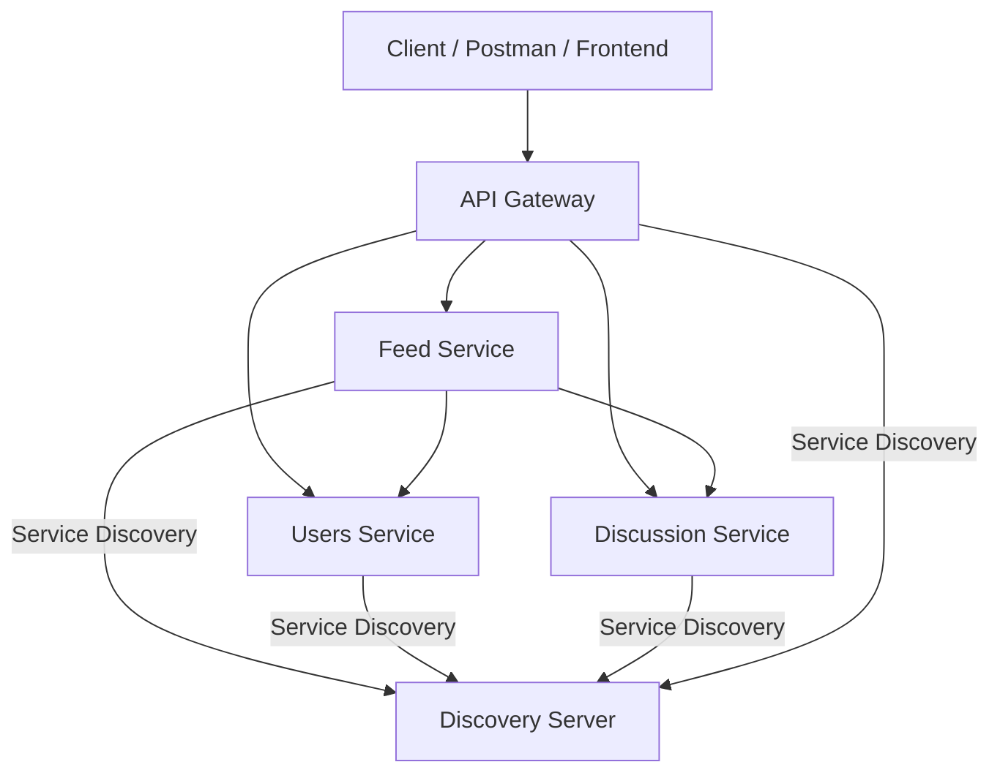

Here is your **current microservices architecture and communication** after all recent changes, in the same format as
your example:

---

# chat-microservices: Architecture & Communication (Current State)

## Microservices Overview

- **users**: Manages user registration, login (with JWT), and user profile data. Uses H2 (in-memory) for local/test,
  MySQL for production (configurable).
- **discussion**: Manages posts and comments.
- **feed**: Aggregates posts and user data to provide a personalized feed.
- **api-gateway**: The single entry point for all client requests, handling authentication (JWT), routing, and
  forwarding to backend services.
- **discoveryserver**: Eureka server for service discovery, allowing services to find each other dynamically.

---

## How They Communicate

- **REST API Calls**: Services communicate via HTTP REST endpoints.
- **Service Discovery**: All services register with the discoveryserver (Eureka), so they can find each other by name.
- **API Gateway Routing**: All external (client) requests go through the API Gateway, which forwards them to the correct
  service.
- **JWT Authentication**: The API Gateway issues JWT tokens on login and validates them for protected endpoints.

### Example Internal Communication

- The **feed** service uses `WebClient` to call:
    - `http://apigateway:8765/api/users/all` to get all users.
    - `http://apigateway:8765/api/posts/all` to get all posts.
    - `http://apigateway:8765/api/users/name/{userName}` to get a specific user.
    - `http://apigateway:8765/api/posts/userId/{userId}` to get posts by a specific user.

---

## What Each Service Does

- **users**: Handles registration (`/api/users/register`), login (`/api/users/login`), and user info endpoints. All
  registration and login go through the API Gateway (`/auth/register`, `/auth/login`).
- **discussion**: Handles posts and comments (e.g., `/api/posts/all`, `/api/posts/userId/{userId}`).
- **feed**: Aggregates data from users and discussion to build a user feed.
- **api-gateway**: Routes all external requests, handles authentication, and forwards requests to the correct backend
  service.
- **discoveryserver**: Enables dynamic service registration and lookup.

---

## How to Visualize or Understand Connections

- **Controller and Service Classes**: Look at REST endpoints in controller classes (e.g., `UserController`,
  `PostController`, `FeedController`).
- **WebClient Usage**: See where services make HTTP calls to other services (e.g., `FeedServiceImpl`).
- **API Gateway Config**: Check how routes are mapped in the gateway’s configuration (RouteConfig.java).
- **Service Discovery**: All services register with the discoveryserver (Eureka).

---

## Summary Diagram

```plaintext
[Client] --> [API Gateway] --> [feed] --> [users]
                                 |         ^
                                 v         |
                             [discussion]--+
```

- **Client**: Any external application (web frontend, mobile app, Postman, curl, etc.) that interacts with your system
  via the API Gateway.
- **API Gateway**: The single entry point for all requests, handles JWT authentication.
- **Feed**: Aggregates data from users and discussion.
- **Users/Discussion**: Provide user and post/comment data.
- **Discoveryserver**: Lets all services find each other by name.

---

## Example API Endpoints (via Gateway)

**Base URL:**

```
http://localhost:8765/
```

### Authentication APIs

| Endpoint         | Method | Description         | Example Body / Usage                                                             |
|------------------|--------|---------------------|----------------------------------------------------------------------------------|
| `/auth/register` | POST   | Register a new user | `{ "userName": "...", "email": "...", "password": "...", "profileName": "..." }` |
| `/auth/login`    | POST   | Get JWT token       | `{ "email": "...", "password": "..." }`                                          |

**How to use:**

- POST to `/auth/login` with your credentials to get a JWT token.
- Use the JWT as a **Bearer Token** in the Authorization header for protected endpoints.

---

### Feed Service APIs (via Gateway)

| Endpoint                | Method | Description                    | Example URL                              |
|-------------------------|--------|--------------------------------|------------------------------------------|
| `/feed/all`             | GET    | Get all feed items             | `http://localhost:8765/feed/all`         |
| `/feed/user/{userName}` | GET    | Get feed for a specific user   | `http://localhost:8765/feed/user/vishnu` |
| `/feed/hello`           | GET    | Test endpoint for feed service | `http://localhost:8765/feed/hello`       |

---

### Users Service APIs (via Gateway)

| Endpoint                     | Method | Description                 | Example URL                                   |
|------------------------------|--------|-----------------------------|-----------------------------------------------|
| `/api/users/all`             | GET    | Get all users               | `http://localhost:8765/api/users/all`         |
| `/api/users/{id}`            | GET    | Get user by user ID         | `http://localhost:8765/api/users/1`           |
| `/api/users/name/{userName}` | GET    | Get user by user name       | `http://localhost:8765/api/users/name/vishnu` |
| `/api/users/greeting`        | GET    | Get greeting with DB values | `http://localhost:8765/api/users/greeting`    |
| `/api/users/config/list`     | GET    | Get sample list from config | `http://localhost:8765/api/users/config/list` |

---

### Discussion Service APIs (via Gateway)

| Endpoint                                  | Method | Description                 | Example URL                                   |
|-------------------------------------------|--------|-----------------------------|-----------------------------------------------|
| `/api/posts/create`                       | POST   | Create a new post           | `http://localhost:8765/api/posts/create`      |
| `/api/posts/{postId}/update`              | PUT    | Update a post               | `http://localhost:8765/api/posts/1/update`    |
| `/api/posts/{postId}`                     | GET    | Get post by ID              | `http://localhost:8765/api/posts/1`           |
| `/api/posts/userId/{userId}`              | GET    | Get posts by user ID        | `http://localhost:8765/api/posts/userId/1`    |
| `/api/posts/all`                          | GET    | Get all posts with comments | `http://localhost:8765/api/posts/all`         |
| `/api/posts/{postId}`                     | DELETE | Delete post by ID           | `http://localhost:8765/api/posts/1`           |
| `/api/posts/{postId}/comment`             | POST   | Add comment to post         | `http://localhost:8765/api/posts/1/comment`   |
| `/api/posts/{postId}/comment/{commentId}` | DELETE | Delete comment from post    | `http://localhost:8765/api/posts/1/comment/2` |
| `/hello`                                  | GET    | Sample hello endpoint       | `http://localhost:8765/hello?name=World`      |

---

## How to Test as a Client

1. **Authenticate and Get JWT**
    - POST to `/auth/login` with your credentials.
    - Use the returned JWT as a Bearer token for all protected endpoints.

2. **Make API Calls**
    - Use the endpoints above, always including the Authorization header for protected endpoints.

---

## How to Understand the Connections

- **Client** (browser, Postman, frontend app) sends requests to the **API Gateway**.
- **API Gateway** routes requests to the correct backend service (users, feed, discussion).
- **Feed** service aggregates data from **users** and **discussion** by making internal HTTP calls (using WebClient).
- **All services** register with the **discoveryserver** (Eureka) for dynamic lookup.

---

## Summary Diagram

```plaintext
[Client/Postman/Frontend]
      |
      v
[API Gateway]
   |     |     |
   v     v     v
[Feed] [Users] [Discussion]
   ^     |      ^
   |     v      |
   +-----+------+
```

---

**Let me know if you want a more detailed diagram, sample request/response bodies, or a deep dive into any specific
service or endpoint!**

---

Absolutely! Here are **detailed diagrams, sample request/response bodies, and a deep dive into the main endpoints** for
your current chat-microservices architecture:

---

## 1. Sample Request & Response Bodies

### **User Registration (via API Gateway)**

**POST** `/auth/register`
**Request:**

```json
{
  "userName": "johndoe",
  "email": "john.doe@example.com",
  "password": "yourPassword123",
  "profileName": "John Doe"
}
```

**Response:**

```json
{
  "message": "User registered successfully",
  "userId": 1,
  "email": "john.doe@example.com",
  "userName": "johndoe"
}
```

---

### **User Login (via API Gateway)**

**POST** `/auth/login`
**Request:**

```json
{
  "email": "john.doe@example.com",
  "password": "yourPassword123"
}
```

**Response:**

```json
{
  "userId": 1,
  "username": "johndoe",
  "token": "eyJhbGciOiJIUzI1NiJ9..."
}
```

---

### **Get All Users (via API Gateway)**

**GET** `/api/users/all`
**Response:**

```json
[
  {
    "id": 1,
    "userName": "johndoe",
    "email": "john.doe@example.com",
    "profileName": "John Doe"
  },
  ...
]
```

---

### **Create a Post (Discussion Service)**

**POST** `/api/posts/create`
**Request:**

```json
{
  "content": "This is a new post!",
  "likes": 0,
  "userId": 1
}
```

**Response:**

```json
{
  "postId": 10,
  "content": "This is a new post!",
  "likes": 0,
  "userId": 1,
  "comments": []
}
```

---

## 2. Main Controller Endpoints (Deep Dive)

### **API Gateway**

- `/auth/register` (POST): Register a new user (forwards to users service).
- `/auth/login` (POST): Authenticate and get JWT (forwards to users service, returns JWT).
- All `/api/users/**`, `/api/posts/**`, `/feed/**` are routed to the appropriate backend service.

---

### **Users Service (UserController.java)**

- `/api/users/register` (POST): Register a new user.
- `/api/users/login` (POST): Login and validate credentials.
- `/api/users/all` (GET): Get all users.
- `/api/users/{id}` (GET): Get user by ID.
- `/api/users/name/{userName}` (GET): Get user by username.
- `/api/users/greeting` (GET): Get greeting/config info.
- `/api/users/config/list` (GET): Get config list.

---

### **Discussion Service (`PostController.java`)**

- `/api/posts/create` (POST): Create a new post.
- `/api/posts/{postId}/update` (PUT): Update a post.
- `/api/posts/{postId}` (GET): Get post by ID.
- `/api/posts/userId/{userId}` (GET): Get posts by user ID.
- `/api/posts/all` (GET): Get all posts with comments.
- `/api/posts/{postId}` (DELETE): Delete post by ID.
- `/api/posts/{postId}/comment` (POST): Add comment to post.
- `/api/posts/{postId}/comment/{commentId}` (DELETE): Delete comment from post.

---

### **Feed Service (`FeedController.java`)**

- `/feed/all` (GET): Get all feed items (aggregates users and posts).
- `/feed/user/{userName}` (GET): Get feed for a specific user.
- `/feed/hello` (GET): Test endpoint.

---

## 3. Architecture Diagram



---

## 4. How a Client Request Flows

1. **Client** sends a request to `http://localhost:8765/auth/login` to get a JWT.
2. **Client** uses the JWT as a Bearer token for all protected endpoints.
3. **Client** requests `http://localhost:8765/feed/all` (with JWT).
4. **API Gateway** authenticates and routes to **Feed Service**.
5. **Feed Service** uses `WebClient` to call:
    - `http://localhost:8765/api/users/all` (to get users)
    - `http://localhost:8765/api/posts/all` (to get posts)
6. **Feed Service** aggregates and returns the feed to the client.

---

## 5. Tips for Testing

- **Always authenticate first** and use the JWT for all protected endpoints.
- Use `/greeting` or `/hello` endpoints to verify each service is up.
- If you get a 401 error, check your token and Authorization header.

---

If you want a **deep dive into any specific endpoint, service, or want more sample requests/responses**, just tell me
which one!