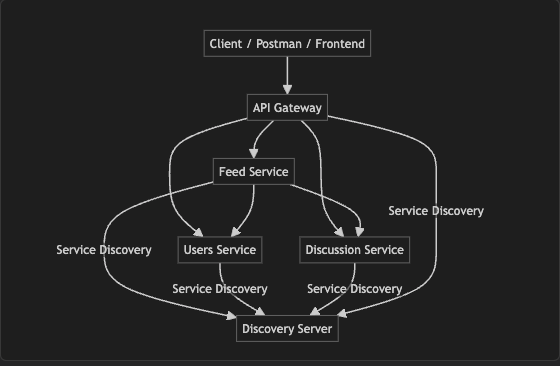

# chat-microservices: Architecture & Communication

## Microservices Overview

- **users**: Manages user data (profiles, user IDs, etc.).
- **discussion**: Manages posts and comments.
- **feed**: Aggregates posts and user data to provide a personalized feed.
- **api-gateway**: The single entry point for all client requests, routing them to the appropriate backend service.
- **discoveryserver**: Eureka server for service discovery, allowing services to find each other dynamically.

---

## How They Communicate

- **REST API Calls**: Services communicate via HTTP REST endpoints.
- **Service Discovery**: All services register with the discoveryserver (Eureka), so they can find each other by name.
- **API Gateway Routing**: All external (client) requests go through the API Gateway, which forwards them to the correct service.

### Example Internal Communication

- The **feed** service uses `WebClient` to call:
    - `http://apigateway:8765/usersservice/users/all` to get all users.
    - `http://apigateway:8765/discussion/api/posts/all` to get all posts.
    - `http://apigateway:8765/usersservice/{userName}` to get a specific user.
    - `http://apigateway:8765/discussion/api/posts/userId/{userId}` to get posts by a specific user.

---

## What Each Service Does

- **users**: Provides user information (e.g., `/users/all`, `/users/{userName}`).
- **discussion**: Handles posts and comments (e.g., `/api/posts/all`, `/api/posts/userId/{userId}`).
- **feed**: Aggregates data from users and discussion to build a user feed (combines user profile info with posts).
- **api-gateway**: Routes all external requests to the correct backend service.
- **discoveryserver**: Enables dynamic service registration and lookup.

---

## How to Visualize or Understand Connections

- **Controller and Service Classes**: Look at REST endpoints in controller classes (e.g., `PostController`, `UserController`, `FeedController`).
- **WebClient Usage**: See where services make HTTP calls to other services (e.g., `FeedServiceImpl`).
- **API Gateway Config**: Check how routes are mapped in the gateway’s configuration.
- **Service Discovery**: All services register with the discoveryserver (Eureka).

---

## Summary Diagram

```plaintext
[Client] --> [API Gateway] --> [feed] --> [users]
                                 |         ^
                                 v         |
                             [discussion]--+
```
- **Client**: Any external application (web frontend, mobile app, Postman, curl, etc.) that interacts with your system via the API Gateway.
- **API Gateway**: The single entry point for all requests.
- **Feed**: Aggregates data from users and discussion.
- **Users/Discussion**: Provide user and post/comment data.
- **Discoveryserver**: Lets all services find each other by name.

---

## Example API Endpoints (via Gateway)

**Base URL:**
```
http://localhost:8765/
```

### Authentication APIs

| Endpoint                              | Method | Description                       | Example Body / Usage                |
|----------------------------------------|--------|-----------------------------------|-------------------------------------|
| `/api/v1/auth/authenticate`            | POST   | Get JWT token                     | `{ "email": "your@email.com", "password": "yourpassword" }` |
| `/api/v1/auth/authenticatetest`        | GET    | Test authentication endpoint      | No body                             |
| `/test`                               | GET    | Test API Gateway is working       | No body                             |

**How to use:**
- POST to `/api/v1/auth/authenticate` with your credentials to get a JWT token.
- Use the JWT as a **Bearer Token** in the Authorization header for protected endpoints.

---

### Feed Service APIs (via Gateway)

| Endpoint                        | Method | Description                         | Example URL                                      |
|----------------------------------|--------|-------------------------------------|--------------------------------------------------|
| `/feed/all`                     | GET    | Get all feed items                  | `http://localhost:8765/feed/all`                 |
| `/feed/user/{userName}`         | GET    | Get feed for a specific user        | `http://localhost:8765/feed/user/vishnu`         |
| `/feed/hello`                   | GET    | Test endpoint for feed service      | `http://localhost:8765/feed/hello`               |

---

### Users Service APIs (via Gateway)

| Endpoint                        | Method | Description                         | Example URL                                      |
|----------------------------------|--------|-------------------------------------|--------------------------------------------------|
| `/users/all`                    | GET    | Get all users                       | `http://localhost:8765/users/all`                |
| `/users/user/{userId}`          | GET    | Get user by user ID                 | `http://localhost:8765/users/user/1`             |
| `/users/{userName}`             | GET    | Get user by user name               | `http://localhost:8765/users/vishnu`             |
| `/users/greeting`               | GET    | Get greeting with DB values         | `http://localhost:8765/users/greeting`           |
| `/users/sampleList`             | GET    | Get sample list from config         | `http://localhost:8765/users/sampleList`         |

---

### Discussion Service APIs (via Gateway)

| Endpoint                                  | Method | Description                         | Example URL                                      |
|--------------------------------------------|--------|-------------------------------------|--------------------------------------------------|
| `/api/posts/create`                        | POST   | Create a new post                   | `http://localhost:8765/api/posts/create`         |
| `/api/posts/{postId}/update`               | PUT    | Update a post                       | `http://localhost:8765/api/posts/1/update`       |
| `/api/posts/{postId}`                      | GET    | Get post by ID                      | `http://localhost:8765/api/posts/1`              |
| `/api/posts/userId/{userId}`               | GET    | Get posts by user ID                | `http://localhost:8765/api/posts/userId/1`       |
| `/api/posts/all`                           | GET    | Get all posts with comments         | `http://localhost:8765/api/posts/all`            |
| `/api/posts/{postId}`                      | DELETE | Delete post by ID                   | `http://localhost:8765/api/posts/1`              |
| `/api/posts/{postId}/comment`              | POST   | Add comment to post                 | `http://localhost:8765/api/posts/1/comment`      |
| `/api/posts/{postId}/comment/{commentId}`  | DELETE | Delete comment from post            | `http://localhost:8765/api/posts/1/comment/2`    |
| `/hello`                                   | GET    | Sample hello endpoint               | `http://localhost:8765/hello?name=World`         |

---

## **How to Test as a Client**

1. **Authenticate and Get JWT**
    - POST to `/api/v1/auth/authenticate` with your credentials.
    - Use the returned JWT as a Bearer token for all other requests.

2. **Make API Calls**
    - Use the endpoints above, always including the Authorization header for protected endpoints.

---

## **How to Understand the Connections**

- **Client** (browser, Postman, frontend app) sends requests to the **API Gateway**.
- **API Gateway** routes requests to the correct backend service (users, feed, discussion).
- **Feed** service aggregates data from **users** and **discussion** by making internal HTTP calls (using WebClient).
- **All services** register with the **discoveryserver** (Eureka) for dynamic lookup.

---

## **Summary Diagram**

```plaintext
[Client/Postman/Frontend]
      |
      v
[API Gateway]
   |     |     |
   v     v     v
[Feed] [Users] [Discussion]
   ^     |      ^
   |     v      |
   +-----+------+
```

---
Absolutely! Here are **sample request bodies**, a **diagram**, and a **deep dive into the main controller endpoints** for each service in your chat-microservices project.

---

## 1. Sample Request Bodies

### **Authentication (API Gateway)**
**POST** `/api/v1/auth/authenticate`
```json
{
  "email": "your@email.com",
  "password": "yourpassword"
}
```

---

### **Create a Post (Discussion Service)**
**POST** `/api/posts/create`
```json
{
  "content": "This is a new post!",
  "likes": 0,
  "userId": 8
}
```

---

### **Update a Post**
**PUT** `/api/posts/{postId}/update`
```json
{
  "content": "Updated post content",
  "likes": 5,
  "userId": 8
}
```

---

### **Add a Comment to a Post**
**POST** `/api/posts/{postId}/comment`
```json
{
  "content": "Nice post!"
}
```

---

## 2. Main Controller Endpoints (Deep Dive)

### **API Gateway**
- `/api/v1/auth/authenticate` (POST): Authenticate and get JWT.
- `/api/v1/auth/authenticatetest` (GET): Test authentication endpoint.
- `/test` (GET): Test API Gateway is working.

---

### **Feed Service (`FeedController.java`)**
- `/feed/all` (GET): Get all feed items (aggregates users and posts).
- `/feed/user/{userName}` (GET): Get feed for a specific user.
- `/feed/hello` (GET): Test endpoint.

---

### **Users Service (`UserController.java`)**
- `/users/all` (GET): Get all users.
- `/users/user/{userId}` (GET): Get user by user ID.
- `/users/{userName}` (GET): Get user by user name.
- `/users/greeting` (GET): Get greeting with DB values.
- `/users/sampleList` (GET): Get sample list from config.

---

### **Discussion Service (`PostController.java`)**
- `/api/posts/create` (POST): Create a new post.
- `/api/posts/{postId}/update` (PUT): Update a post.
- `/api/posts/{postId}` (GET): Get post by ID.
- `/api/posts/userId/{userId}` (GET): Get posts by user ID.
- `/api/posts/all` (GET): Get all posts with comments.
- `/api/posts/{postId}` (DELETE): Delete post by ID.
- `/api/posts/{postId}/comment` (POST): Add comment to post.
- `/api/posts/{postId}/comment/{commentId}` (DELETE): Delete comment from post.

---

## 3. Example Diagram



---

## 4. Example: How a Client Request Flows

1. **Client** sends a request to `http://localhost:8765/feed/all` with a JWT token.
2. **API Gateway** authenticates the request and routes it to the **Feed Service**.
3. **Feed Service** uses `WebClient` to call:
    - `http://apigateway:8765/usersservice/users/all` (to get users)
    - `http://apigateway:8765/discussion/api/posts/all` (to get posts)
4. **Feed Service** aggregates the data and returns the feed to the client.

---

## 5. Tips for Testing

- **Always authenticate first** and use the JWT for all protected endpoints.
- Use `/test` endpoints to verify each service is up.
- If you get a 401 error, check your token and Authorization header.

---