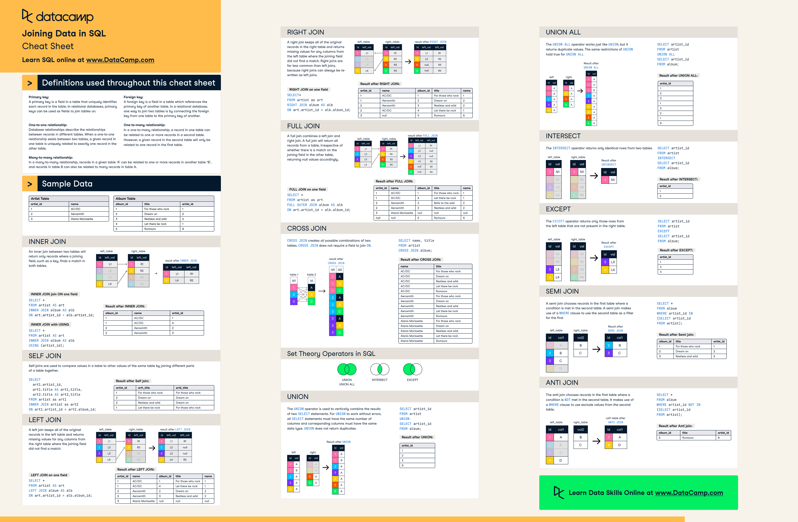

```mysql-sql
CREATE TABLE posts (
    id INT AUTO_INCREMENT PRIMARY KEY,
    content TEXT,
    likes INT
);

CREATE TABLE comments (
    id INT AUTO_INCREMENT PRIMARY KEY,
    content TEXT,
    post_id INT,
    FOREIGN KEY (post_id) REFERENCES posts(id)
);
```

##### Inner Join:

An inner join returns only the rows from both tables that satisfy the join condition. In other words, it returns rows
where there is a match between the joining columns in both tables.
If there is no match for a row in one table, that row is not included in the result set.
It effectively filters out unmatched rows from both tables.

Example: Suppose you have posts and comments tables. An inner join between them retrieves only posts that have
associated comments and comments that are linked to existing posts.

```mysql-sql
SELECT p.*, c.*
FROM posts p
INNER JOIN comments c ON p.id = c.post_id;
```

##### Left Join:

A left join returns all rows from the left table (the first table listed) and the matching rows from the right table (
the second table listed). If there is no match in the right table, NULL values are used for the columns from the right
table.
It ensures that all rows from the left table are included in the result set, regardless of whether there is a match in
the right table.

Example: Using the posts and comments tables, a left join retrieves all posts along with their associated comments. If a
post has no comments, it will still be included in the result set with NULL values for the comment columns.

```mysql-sql
SELECT p.*, c.*
FROM posts p
LEFT JOIN comments c ON p.id = c.post_id;
```

##### Right Join:

A right join returns all rows from the right table and the matching rows from the left table. If there is no match in
the left table, NULL values are used for the columns from the left table.
It ensures that all rows from the right table are included in the result set, regardless of whether there is a match in
the left table.

Example: Using the posts and comments tables, a right join retrieves all comments along with their associated posts. If
a comment has no corresponding post, it will still be included in the result set with NULL values for the post columns.

```mysql-sql
SELECT p.*, c.*
FROM posts p
RIGHT JOIN comments c ON p.id = c.post_id;
```